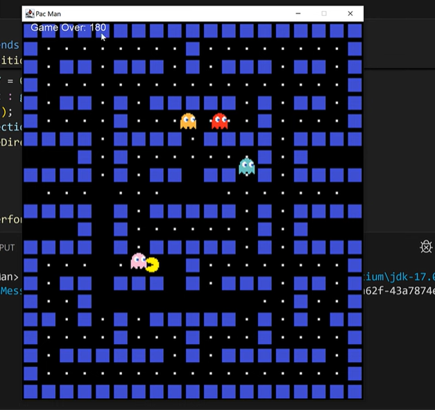
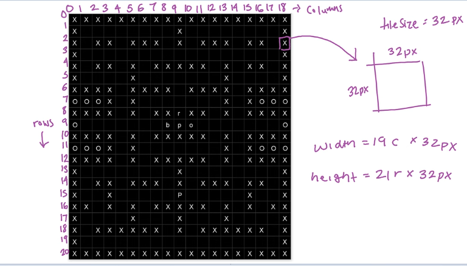

# Pac-Man Game

A faithful recreation of the iconic 1980s arcade classic, Pac-Man, built from scratch in Java using the Swing GUI framework. In this game, you control the yellow Pac-Man character through a labyrinthine maze, gobbling up white dots (pellets) to rack up points while evading four colorful ghosts: Blinky (red), Pinky (pink), Inky (blue), and Clyde (orange). Each pellet is worth 10 points, and clearing the entire maze resets the level while preserving your score. Survive with 3 lives—collide with a ghost and lose one, hitting zero ends the game. Press arrow keys to navigate, and restart instantly after Game Over for endless replayability.

This project serves as an excellent educational tool for learning Java game development basics, including event handling, collision detection, and simple AI behaviors. It's lightweight, runs on any machine with Java 8+, and clocks in at under 500 lines of code. High score so far: 180 points—can you beat it?


*Game Over screen displaying the final score (180) amid the maze remnants, with Pac-Man and ghosts frozen in place.*


*Detailed grid view of the 21-row × 19-column maze layout, each tile 32×32 pixels. Walls (X) form the barriers, empty spaces (O) allow passage, and starting positions for Pac-Man (P) and ghosts (b/o/p/r) are marked.*

## Table of Contents
- [Features](#features)
- [Technologies](#technologies)
- [Installation](#installation)
- [Running the Game](#running-the-game)
- [Code Structure](#code-structure)
- [How It Works](#how-it-works)
- [Screenshots](#screenshots)
- [Limitations & Future Enhancements](#limitations--future-enhancements)
- [Contributing](#contributing)
- [License](#license)

## Features
- **Intuitive Controls**: Arrow keys (↑ ↓ ← →) for smooth Pac-Man movement in four cardinal directions. Direction changes are immediate and responsive.
- **Dynamic Scoring System**: Collect 10 points per pellet. Total score displays in real-time at the top-left, alongside remaining lives (starts at x3).
- **Ghost AI**: Four ghosts patrol the maze with randomized movements and basic collision avoidance. They reverse direction on wall hits or screen edges, adding unpredictability without overwhelming complexity.
- **Lives & Game Over**: Lose a life on ghost collision; reset positions after each loss. At 0 lives, the game pauses with a "Game Over: [Score]" message—press any arrow key to restart with full lives and zeroed score.
- **Level Reset**: Eat all pellets to clear the maze, instantly reloading the layout and repositioning all entities for seamless replay.
- **Visual Polish**: Custom PNG sprites for directional Pac-Man mouths and static ghost designs. Blue-tiled walls and white pellets evoke the original arcade aesthetic on a black background.
- **Performance**: Runs at ~20 FPS via a 50ms game loop timer, ensuring fluid motion on modest hardware.

## Technologies
- **Core Language**: Java (JDK 8 or higher for broad compatibility—no modern features required).
- **GUI Framework**: Swing (JPanel for rendering, JFrame for the window, Timer for the game loop).
- **Data Structures**: HashSet for efficient management of walls, pellets, and ghosts (O(1) lookups for collisions).
- **Graphics**: AWT for drawing images and shapes; ImageIcon for loading assets from `./assets/`.
- **Input Handling**: KeyListener for keyboard events (arrow keys trigger direction updates).
- **Other Libraries**: Built-in `java.util.Random` for ghost pathing; no external dependencies.

## Installation
Getting started is straightforward—no build tools or package managers needed. Just Java and your assets.

1. **Clone the Repository**:
   ```
   git clone https://github.com/yourusername/pacman-java.git
   cd pacman-java
   ```

2. **Set Up Assets**:
   Create an `./assets/` folder in the project root (or relative to compiled classes) and add these PNG files (32×32 pixels recommended):
   - Walls: `wall.png` (blue brick texture).
   - Ghosts: `redGhost.png`, `pinkGhost.png`, `orangeGhost.png`, `blueGhost.png`.
   - Pac-Man: `pacmanUp.png`, `pacmanDown.png`, `pacmanLeft.png`, `pacmanRight.png` (open-mouth sprites facing each direction).
   
   *Tip*: You can source free retro sprites from sites like OpenGameArt.org or create simple ones in tools like Aseprite.

3. **Verify Java Installation**:
   Run `java -version` in your terminal. Ensure JDK 8+ is installed (e.g., via Oracle JDK, OpenJDK, or your OS package manager).

## Running the Game
The game launches in a compact 608×672 pixel window—perfect for quick sessions.

### Via Command Line
Navigate to the project directory and compile/run:
```
javac -d . *.java  # Or specify package: javac Pacman/*.java
java Pacman.App    # Assumes package Pacman; adjust if needed
```

### Via IDE (Recommended for Development)
- Import into IntelliJ IDEA, Eclipse, or VS Code with Java extension.
- Set `App.java` as the main class and run.
- Debug mode lets you step through collisions or movement logic easily.

*Pro Tip*: Focus the window immediately after launch (via `requestFocus()`) for instant key input. Use fullscreen mode in your IDE for an immersive test.

## Code Structure
The project is minimal: two Java files in the `Pacman` package. Everything is self-contained.

| File          | Purpose                          | Key Components |
|---------------|----------------------------------|----------------|
| **App.java** | Entry point: Sets up JFrame and launches the game panel. | `main()` method, window config (size, close op, centering). |
| **Pacman.java** | Core: Handles rendering, logic, input, and entities. | `Block` inner class, `tileMap` array, `move()`, `collision()`, event listeners. |

- **Total LOC**: ~400 (excluding comments).
- **Package**: `Pacman` for organization.
- **No Config Files**: Maze is hardcoded in `tileMap`; tweak it for custom levels!

For a deeper dive, see the [full code snippets](#code-snippets) below.

## How It Works
Under the hood, it's a classic game loop: Update → Render → Repeat.

1. **Initialization** (`Pacman()` constructor):
   - Load maze from `tileMap` string array into Block entities.
   - Assign random initial directions to ghosts.
   - Start 50ms Timer for `actionPerformed()`.

2. **Input** (`keyReleased()`):
   - Map arrow keys to directions ('U'/'D'/'L'/'R').
   - Swap Pac-Man's sprite image accordingly.

3. **Update** (`move()` per frame):
   - Apply velocities to Pac-Man and ghosts.
   - Detect wall collisions (reverse position).
   - Check ghost overlaps (deduct life, reset if fatal).
   - Consume pellets (score +10, remove from set).
   - Maze clear? Reload and reposition.

4. **Render** (`paintComponent()` → `draw()`):
   - Draw entities in order: Pac-Man, ghosts, walls, pellets (as filled rects).
   - Overlay score/lives text.

5. **Collision Detection**: Simple AABB (Axis-Aligned Bounding Box) checks—no physics engine needed.

Ghosts get a quirky boost: At the maze's central row (y=288px), they prioritize upward movement for chaotic chases.

## Code Snippets
### Maze Layout (`tileMap` in Pacman.java)
```java
private String[] tileMap = {
    "XXXXXXXXXXXXXXXXXXX",  // Top border
    "X        X        X",  // Open paths
    // ... (full 21 rows with 'X' walls, ' ' pellets, 'P' Pac-Man, ghost letters)
    "XXXXXXXXXXXXXXXXXXX"   // Bottom border
};
```
*Customize: Swap chars to redesign—'O' skips placement entirely.*

### Collision Check
```java
public boolean collision(Block a, Block b) {
    return a.x < b.x + b.width && a.x + a.width > b.x &&
           a.y < b.y + b.height && a.y + a.height > b.y;
}
```
*Efficient for grid-based games; runs in O(n) per entity.*

## Screenshots
- **In-Action Play**: Imagine Pac-Man mid-munch—add your own gameplay GIF to `screenshots/play.gif` for dynamism.
- **Grid Overlay**: The annotated diagram shows row/column indexing for easy modding.

(Upload images to `/screenshots/` and reference via Markdown for GitHub rendering.)

## Limitations & Future Enhancements
This is a "minimum viable Pac-Man"—fun but basic. Here's what's missing and ideas to level up:

| Limitation              | Why It Matters                  | Enhancement Idea |
|-------------------------|---------------------------------|------------------|
| **Random Ghost AI**    | Predictable after a few runs.  | Implement original modes: Chase (Blinky), Ambush (Pinky), etc., using pathfinding (A* algorithm). |
| **No Power Pellets**   | Can't eat ghosts for bonus pts.| Add large pellets that make ghosts edible (blue/vulnerable sprites, reverse scoring). |
| **Single Maze**        | No progression.                | Procedural generation or multi-level array; speed up ghosts per clear. |
| **Basic Graphics**     | Static sprites, no anims.      | Add mouth-open/close animation via frame swapping; integrate Java Sound for "waka-waka" eats. |
| **No High Scores**     | Forgets your best run.         | Save to file (java.io) or local DB; display leaderboard. |

Fork it and PR improvements—let's make it arcade-perfect!

## Contributing
Love retro games? Help expand this:
1. Fork the repo.
2. Create a feature branch (`git checkout -b feature/power-pellets`).
3. Commit changes (`git commit -m "Add power pellet mechanics"`).
4. Push and open a PR.

Issues welcome for bugs or ideas. Follow Java conventions (e.g., Oracle style guide).

## License
This project is licensed under the MIT License - see the [LICENSE](LICENSE) file for details. Free to use, modify, and distribute—attribute if you share!

---

*Revived with Java pixels for the 2020s. Waka-waka your way to glory! 🚀 Built by [Your Name], October 2025.*